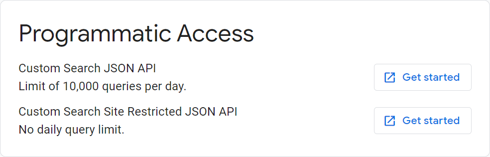

# Google Search의 API 키 발급하기
제8장과 제9장에서 언급된 Google Search API를 사용하려면, API 키를 발급해야 합니다.

API 키의 발급 방법은 아래와 같습니다.

1. [Programmable Search Engine](https://programmablesearchengine.google.com/) 페이지를 열고 'Get Started' 버튼을 클릭합니다. 계정을 입력하면 다음 단계로 넘어갑니다.

2. 'Add' 버튼을 눌러 새 검색 엔진을 생성합니다. 이름은 자유롭게 입력하시고, What to search? 항목은 Search the entire web을 선택합니다. I'm not a robot을 클릭하고, 'Create' 버튼을 클릭하여 검색 엔진을 생성합니다.

3. 다음 그림과 같은 화면이 표시되면 검색 엔진이 정상적으로 생성된 것입니다.

4. 'Customize'를 클릭하면 다음 그림과 같은 화면이 표시됩니다. Basic에서 Search Engine ID 우측의 복사 버튼을 클릭해 복사한 후 안전한 곳에 저장합니다.

5. Programmatic Access에서 Custom Search JSON API 우측의 'Get started' 버튼을 클릭합니다.

6. 다음 그림과 같은 화면이 표시되면 'Get a key' 버튼을 클릭합니다.

7. Enable Custom Search API 대화 상자에서 Select or create project를 클릭하고, 앞에서 생성한 검색 엔진을 선택합니다. NEXT 버튼이 활성화되면 클릭합니다.

8. 아래 그림과 같은 화면이 표시되면 'SHOW KEY' 버튼을 클릭합니다. API 키가 표시되면 복사한 후 안전한 곳에 저장합니다.

9. 'DONE' 버튼을 클릭하여 작업을 완료합니다.