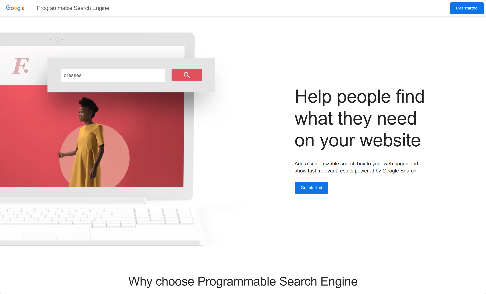

# Google Search의 API 키 발급하기
제8장과 제9장에서 언급된 Google Search API를 사용하려면, API 키를 발급해야 합니다.

API 키의 발급 방법은 아래와 같습니다.

1. [Programmable Search Engine](https://programmablesearchengine.google.com/) 페이지를 열고 'Get Started' 버튼을 클릭합니다. 계정을 입력하면 다음 단계로 넘어갑니다.

